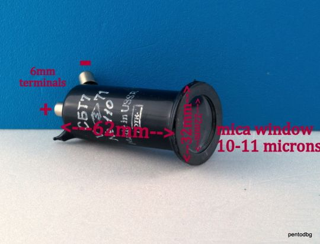
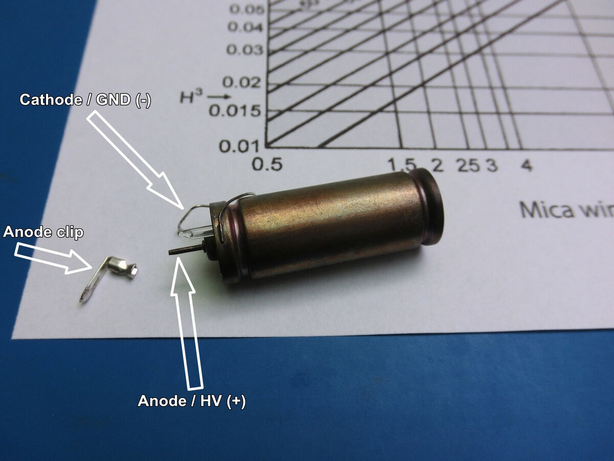
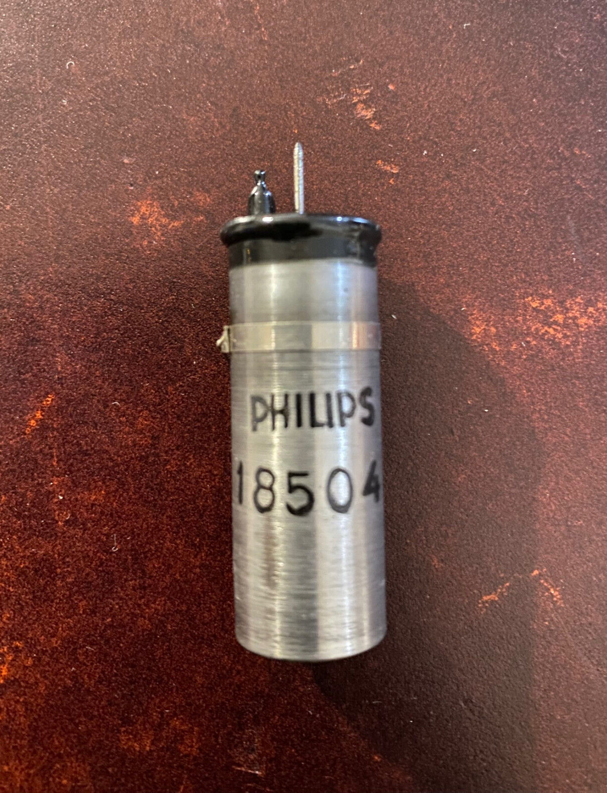
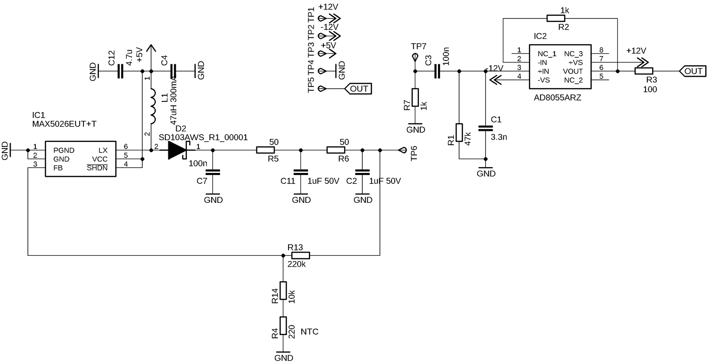
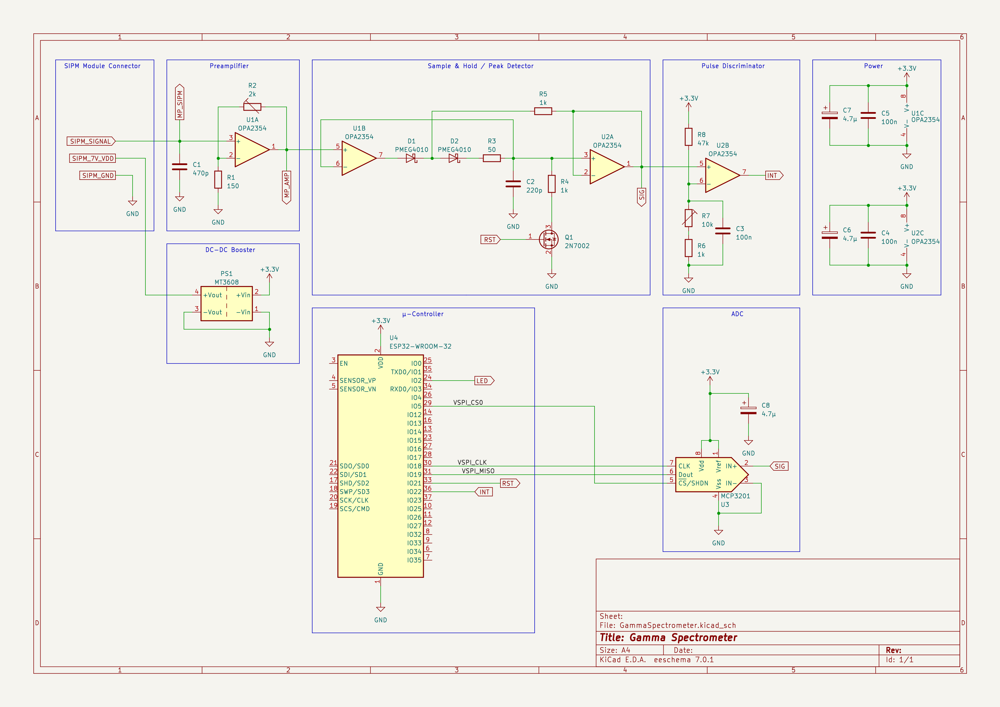
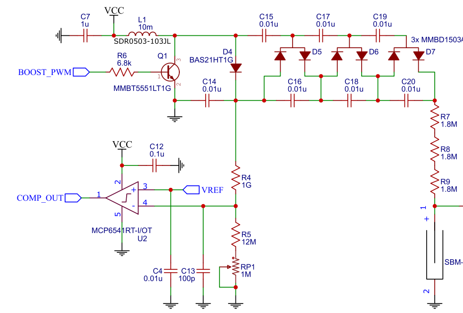

# Opciones para el desarrollo del detector de radiación

**Versión**: 0\  
**Autor/a**: Pablo Morán Peña\  
**Contacto**: [pablomoranbaza@correo.ugr.es](mailto:pablomoranbaza@correo.ugr.es)\  
**Fecha de Creación**: 17/12/2024

---

## 1. Tubo Geiger
El **tubo Geiger** es la opción más barata y sencilla para la detección de radiación. Funciona con un voltaje de operación entre **350 y 500 V**, y los circuitos necesarios para su acondicionamiento y polarización están ampliamente documentados. 

Se usaría un tubo con **ventana de mica** que permita la detección de partículas alfa. Estas son algunas opciones:

### SBT-7
- **Descripción**: Tubo Geiger con ventana de mica.
- **Enlace**: [SBT-7 en eBay](https://www.ebay.es/itm/267096028919?_skw=tubo+geiger+mica&itmmeta=01JFAFR0JAVARAJDXPPMKW6PS7&hash=item3e3029f6f7:g:SwwAAOSwiqtnW-AQ&itmprp=enc%3AAQAJAAAA0HoV3kP08IDx%2BKZ9MfhVJKlKqMviFU0erECBNldI5qqs3tokjiz62LMWWUMYzph2Mmf5BdKCfEIbndHAXV4KruTh%2FlqEGvNTSleen5%2BxBT46%2BgXefTMMRgvhZrDDOJtbNrhAzOBvGgToljKKbi%2BuYdxJcDobOj4W8lEXMbvnDf86WCcaw1A%2BB%2BzesooqOqoAzBigX3PuLnimvTPvtXTjXT3YVLltWWPuyG4zy0KgdY0k%2Fhmi80ekTu%2FSvnH3VS3kh2%2BV4Hyoh12swQUo4oo1M80%3D%7Ctkp%3ABk9SR56J4M_6ZA)
- **Imagen**:

### LND-712
- **Descripción**: Tubo más moderno pero mas caro.
- **Enlace**: [LND-712 en eBay](https://www.ebay.es/itm/315446268793?_skw=alpha+geiger+tube&itmmeta=01JFAG7AAT6GBYH5VP9M5M47FZ&hash=item4972101379:g:2VYAAOSwV61mcGGh&itmprp=enc%3AAQAJAAAA8HoV3kP08IDx%2BKZ9MfhVJKmY71fYKnv1u0CQrm%2B6AFLHX5ARMKcg95vmcA5AVbt04Fcp%2FZc%2BK97H9ED%2FuIytSzYzi4gWsPlpsta9Oyj6M%2BSuwex0Oe2YxkEnLQHSBw7n%2FDzqZmHtaGArWNvZq4BHsS9WBUHX61w4HCtY4qu7mGmqTRCwkYJlJZNW1ZGVSY0suijUefnUZv1oUh1Y%2F4LEInwtSE8AGhVonXKDBxDACJ%2Fi1LB9LTAg7BvJB9Uv265KaFo70EvvFIxNf%2FEr8mqNFpufuiP8B6YdFlIvjvlimg73r2fCinI9kB%2BaJCnmmwiWHQ%3D%3D%7Ctkp%3ABFBMxqWd0Ppk)
- **Imagen**:

### Philips 18504
- **Descripción**: Alternativa barata similar al LND-712, practicamente solo se puede encontrar de segunda mano.
- **Enlace**: [Philips 18504 en eBay](https://www.ebay.es/itm/365117266204?_skw=PHILIPS+18504&itmmeta=01JFAGC5HFZ0CQ2KDXB7WDE6D3&hash=item5502af591c:g:VEYAAOSwY5lmfyIW&itmprp=enc%3AAQAJAAAA0HoV3kP08IDx%2BKZ9MfhVJKkMzTbGTZuqUKZct5UDFe9pq1F5VvQ0qjXWxj%2BzHnL%2FZIcOZF23hFnoXeaBCoD%2FPqHxAvheGVPRRoPBqE%2FLwenA9qWCsZn1mEHh2ZCu7yqlHShbjF%2Bl25TbEr5dPQeoVhZ0xupMd9yx8eC48nbQ5a8qFO54SGHWhzC1kBmD%2B95A%2BW66Y00XipToU4izSKfs12bnDyOBI0GRL23HJi5GZ5emeOwuXS01qCXWBv%2FtAqbPptoFK1%2FVYPMhRYeFPsf4OUQ%3D%7Ctkp%3ABk9SR-TYsND6ZA)
- **Imagen**:

---

## 2. Centelleador con fotomultiplicador de silicio
El **centelleador** junto con un **fotomultiplicador de silicio** es una opción moderna y bastante usada ultimamente en proyectos caseros. Los componentes se pueden adquirir **nuevos** y a un precio razonable.

- **Fotomultiplicador de silicio recomendado**: [MICROFC-30035-SMT-TR](https://www.mouser.es/ProductDetail/onsemi/MICROFC-30035-SMT-TR?qs=byeeYqUIh0Mh9KJVNOFZEA%3D%3D&mgh=1&vip=1&gad_source=1)
- **Cristal centelleador**: Tiene que ser compatible con el tamaño del fotomultiplicador (se comparía en eBay o similares).

Estos detectores necesitan un voltaje de polarización **estable** de aproximadamente **28 V**. El siguiente esquema muestra un circuito de polarización y detección con un ESP32, la variación de temperatura está compensada mediante una **NTC**:

---

## 3. Detector de barrera de silicio
Los **detectores de barrera de silicio** son la opción más **cara** y menos accesible, por lo que no se usan en proyectos caseros y no hay mucha información sobre los circuitos de acondicionamiento, hay que buscar en fuentes mas técnicas. 
- Necesitan un voltaje de alrededor de **50 V**.

---

## 4. Sistema combinado para los tres sensores
Se ha planteado la opción de diseñar un sistema capaz de utilizar los **tres sensores** simultáneamente. Sin embargo, esto implica varios retos:

1. **Fuente de alimentación ajustable**: Debe cubrir un rango de **0 V a 500 V** con precisión.
   - Para el tubo Geiger, se podría utilizar un **convertidor boost** con un **multiplicador**:
    

2. Para los otros dos sensores, bastaría con eliminar la etapa del multiplicador.

Una posible solución sería sacar una salida antes y otra después del multiplicador para alimentar los tres sensores. Pero no se si eso afectaría al rendimiento general.

---

## Conclusión
Se debe considerar si es más eficiente centrarse en un **único tipo de detector** para desarrollar un circuito a medida o si se puede implementar un sistema que combine los tres sensores de manera eficiente y funcional.

## Enlaces útiles
[Centelleador](https://github.com/mkgeiger/gamma-spectroscopy/tree/main)
[Geiger con buena fuente de alimentación](https://hackaday.io/project/187553-compact-low-power-geiger-counter)
[Todo sobre tubos geiger](https://sites.google.com/site/diygeigercounter/technical/gm-tubes-supported)
[Otro centelleador casero](https://hackaday.com/2024/06/05/gamma-ray-spectroscopy-the-pomelo-way/)
